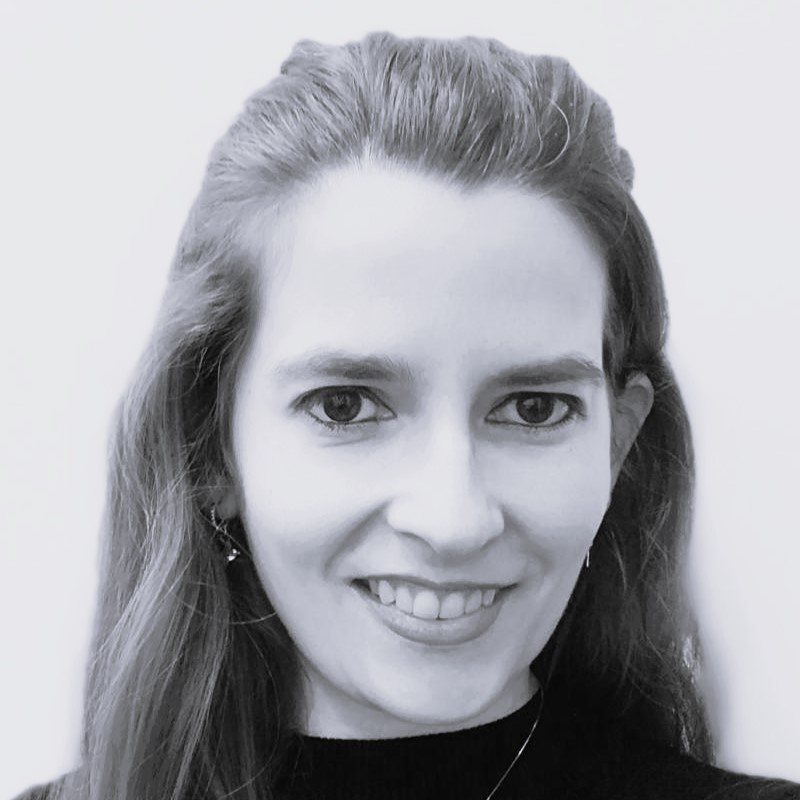
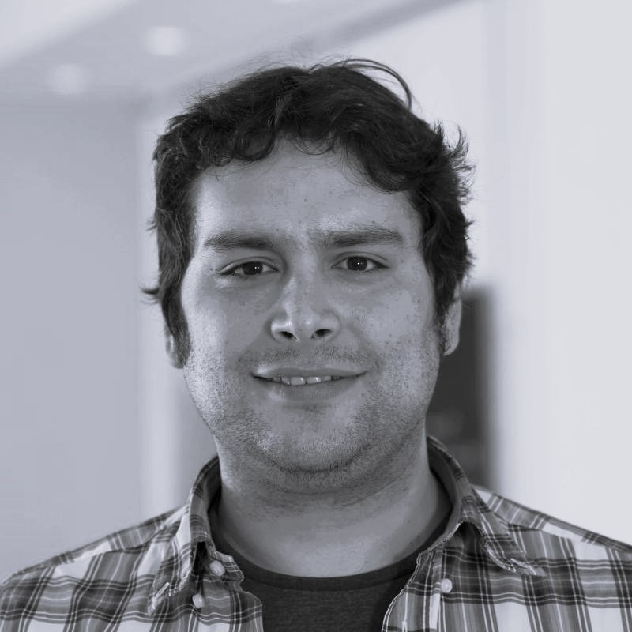

Our research is focused on impulsive and structural dynamics. You can find out more about us and our research below.

## Our team 
### **Current Academics**

  
  
<strong> Prof. Filipe Teixeira-Dias</strong> Personal Chair of Impulsive Dynamics

  
  
<strong>Dr Francisca Martinez-Hergueta</strong> Reader

  
  
<strong>Dr David Garcia Cava</strong> Senior Lecturer

### **Current PhD Students** 

  
  
<strong>Maisie Edwards-Mowforth</strong> Bio coming soon

  
  
<strong>Thomas Aston</strong> Bio coming soon

  
  
<strong>Kayleigh Fowler</strong> Bio coming soon

### **Current MEng and BEng Students**