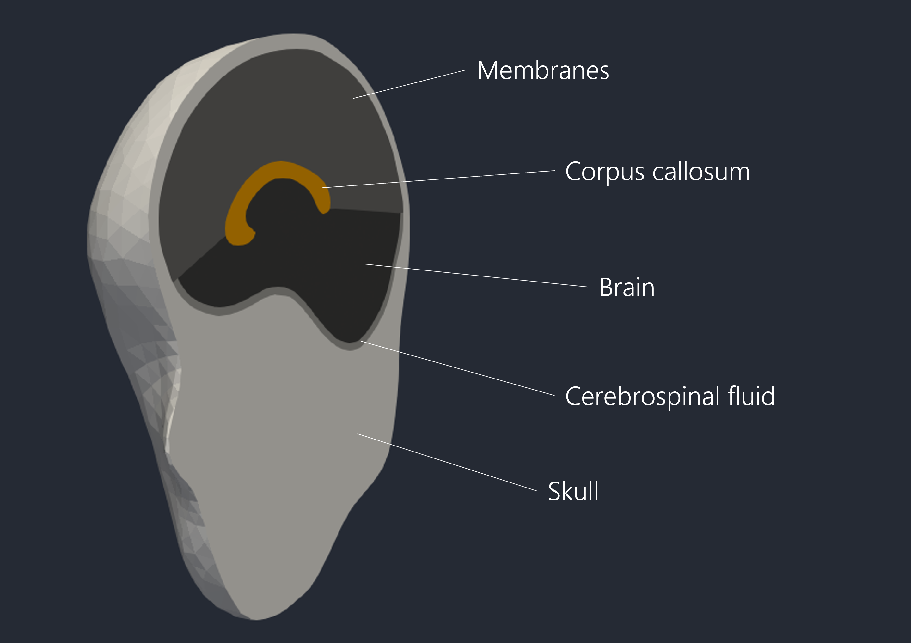

The following page is still under construnction...

[Download the latest release (coming soon)](https://github.com/isDynamics/EdiFEHM){: .btn .btn--primary}

The Edinburgh Finite Element Head Model, EdiFEHM, was developed during 

  <video width="200" autoplay muted loop playsinline>
    <source src="../assets/videos/edifehm1.mp4" type="video/mp4">
    Your browser does not support the video tag.
  </video>
  <video width="200" autoplay muted loop playsinline>
    <source src="../assets/videos/edifehm2.mp4" type="video/mp4">
    Your browser does not support the video tag.
  </video>
  <video width="200" autoplay muted loop playsinline>
    <source src="../assets/videos/edifehm3.mp4" type="video/mp4">
    Your browser does not support the video tag.
  </video>

Translate global head kinematics to detailed spatiotemporal mechanical response of the brain. 

